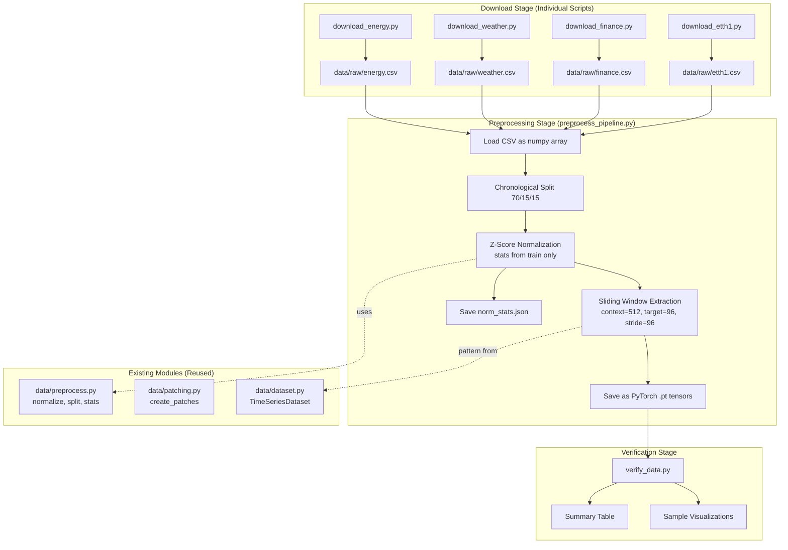

# Design Document: Data Pipeline

## Overview

This design describes the complete data pipeline for the Time Series Foundation Model project. The pipeline downloads four real-world time series datasets (Energy, Weather, Finance, ETTh1), preprocesses them through normalization, patching, windowing, and chronological splitting, and saves the results as PyTorch tensors for efficient training and evaluation.

The pipeline is structured as a set of individual download scripts that produce standardized CSV files, followed by a unified preprocessing step that leverages existing modules (`data/preprocess.py`, `data/patching.py`, `data/dataset.py`), and a verification script that validates the processed outputs.

### Key Design Decisions

1. **Individual download scripts over monolithic downloader**: Each dataset has unique source APIs and extraction logic (HuggingFace datasets, raw GitHub CSV, yfinance). Separate scripts (`download_energy.py`, `download_weather.py`, `download_finance.py`, `download_etth1.py`) keep each domain's logic isolated and independently runnable, while the existing `data/download.py` remains as a legacy/convenience orchestrator.

2. **Reuse existing preprocessing modules**: The existing `data/preprocess.py` already implements normalization, splitting, and stats persistence. The existing `data/patching.py` handles patch creation. The design extends these with a new orchestration layer for windowing and tensor saving rather than rewriting them.

3. **Standardized intermediate CSV format**: All download scripts produce a two-column CSV (`timestamp`, `value`) in `data/raw/`, creating a uniform interface for the preprocessing stage regardless of the source format.

4. **PyTorch tensor output format**: Processed data is saved as `.pt` files containing dictionaries with `context` and `target` tensors, enabling fast loading without re-preprocessing during training.

## Architecture



### Pipeline Flow

1. **Download**: Each script independently fetches its dataset, extracts the target column, and saves a standardized CSV.
2. **Preprocess**: A unified script loads each CSV, applies chronological splitting, normalization (using training stats only), sliding window extraction, and saves PyTorch tensors.
3. **Verify**: A verification script loads all processed tensors and prints a summary table with sample counts, patch counts, and value ranges.

## Components and Interfaces

### New Components

#### 1. `data/download_energy.py`

Downloads the UCI Electricity Load dataset from HuggingFace datasets.

```python
def download_energy(output_path: str = "data/raw/energy.csv") -> str:
    """Download energy dataset from HuggingFace datasets.
    
    Uses 'monash_tsf/electricity_hourly' as primary source.
    Extracts first household (index 0), first 100,000 time steps.
    Saves as CSV with 'timestamp' and 'value' columns.
    
    Returns:
        Path to saved CSV file.
    
    Raises:
        RuntimeError: If download fails after MAX_RETRIES attempts.
        ValueError: If series has fewer than 100,000 time steps.
    """
```

#### 2. `data/download_weather.py`

Downloads the Weather dataset (WTH.csv) from the PatchTST repository.

```python
def download_weather(output_path: str = "data/raw/weather.csv") -> str:
    """Download weather dataset from PatchTST GitHub repository.
    
    Downloads WTH.csv, extracts 'OT' (oil temperature) column.
    Saves as CSV with 'timestamp' and 'value' columns.
    
    Returns:
        Path to saved CSV file.
    
    Raises:
        RuntimeError: If download fails after MAX_RETRIES attempts.
        ValueError: If 'OT' column missing or file has < 1000 rows.
    """
```

#### 3. `data/download_finance.py`

Downloads Bitcoin hourly OHLCV data using yfinance.

```python
def download_finance(output_path: str = "data/raw/finance.csv") -> str:
    """Download Bitcoin hourly close prices via yfinance.
    
    Uses ticker 'BTC-USD', interval '1h', period '2y'.
    Extracts 'Close' column, forward-fills NaN values.
    Saves as CSV with 'timestamp' and 'value' columns.
    
    Returns:
        Path to saved CSV file.
    
    Raises:
        RuntimeError: If download fails after MAX_RETRIES attempts.
        ValueError: If fewer than 1000 rows returned.
    """
```

#### 4. `data/download_etth1.py`

Downloads the ETTh1 benchmark dataset from the ETDataset repository.

```python
def download_etth1(output_path: str = "data/raw/etth1.csv") -> str:
    """Download ETTh1 dataset from ETDataset GitHub repository.
    
    Downloads ETTh1.csv, extracts 'OT' column.
    Includes source-level warning comment about zero-shot-only usage.
    Saves as CSV with 'timestamp' and 'value' columns.
    
    Returns:
        Path to saved CSV file.
    
    Raises:
        RuntimeError: If download fails after MAX_RETRIES attempts.
        ValueError: If 'OT' column missing or file has < 17,000 rows.
    """
```

#### 5. `data/preprocess_pipeline.py`

Orchestrates the full preprocessing pipeline for all datasets.

```python
def create_windows(
    data: np.ndarray,
    context_length: int = 512,
    forecast_horizon: int = 96,
    stride: int = 96,
) -> tuple[np.ndarray, np.ndarray]:
    """Extract sliding windows from a 1-D normalized time series.
    
    Args:
        data: 1-D array of normalized time steps.
        context_length: Input window size (default 512).
        forecast_horizon: Target window size (default 96).
        stride: Step between consecutive windows (default 96).
    
    Returns:
        Tuple of (contexts, targets) arrays:
          - contexts: shape (num_samples, context_length)
          - targets: shape (num_samples, forecast_horizon)
    """

def process_dataset(
    dataset_name: str,
    raw_path: str,
    output_dir: str = "data/processed",
) -> dict[str, int]:
    """Full preprocessing for a single dataset.
    
    Steps:
      1. Load CSV, extract 'value' column as numpy array
      2. Chronological split (70/15/15) via preprocess.split_chronological
      3. Compute normalization stats from train split
      4. Normalize all splits via preprocess.normalize
      5. Extract sliding windows from each split
      6. Save as PyTorch .pt tensors
      7. Save normalization stats as JSON
    
    Returns:
        Dictionary with sample counts: {'train': N, 'val': N, 'test': N}
    """

def run_pipeline(datasets: list[str] | None = None) -> None:
    """Run the full preprocessing pipeline for specified datasets.
    
    Args:
        datasets: List of dataset names to process. 
                  Defaults to ['energy', 'weather', 'finance', 'etth1'].
    """
```

#### 6. `data/verify_data.py`

Verification script that validates processed outputs.

```python
def load_processed_dataset(dataset_name: str, processed_dir: str = "data/processed") -> dict:
    """Load all splits for a processed dataset.
    
    Returns:
        Dictionary with keys 'train', 'val', 'test', each containing
        a dict with 'context' and 'target' tensors.
    
    Raises:
        FileNotFoundError: If any split file is missing.
    """

def compute_dataset_stats(dataset_name: str, splits: dict) -> dict:
    """Compute summary statistics for a processed dataset.
    
    Returns:
        Dictionary with: train_samples, val_samples, test_samples,
        num_patches, value_min, value_max.
    """

def print_summary_table(all_stats: dict[str, dict]) -> None:
    """Print formatted summary table of all datasets."""

def plot_sample_series(all_splits: dict[str, dict], output_path: str | None = None) -> None:
    """Plot first test context window from each dataset."""

def verify_all(processed_dir: str = "data/processed") -> None:
    """Main verification entry point. Loads, validates, prints, and plots."""
```

### Existing Modules (Reused As-Is)

| Module | Functions Used | Purpose |
|--------|--------------|---------|
| `data/preprocess.py` | `split_chronological()`, `compute_normalization_stats()`, `normalize()`, `inverse_normalize()`, `save_normalization_stats()` | Splitting, normalization, stats persistence |
| `data/patching.py` | `create_patches()`, `compute_num_patches()` | Patch creation for verification stats |
| `data/dataset.py` | `TimeSeriesDataset` | Used at training time to wrap loaded tensors |
| `config.py` | `Config.CONTEXT_LENGTH`, `Config.FORECAST_HORIZON`, `Config.PATCH_LEN`, `Config.PATCH_STRIDE`, `Config.TRAIN_RATIO`, `Config.VAL_RATIO`, `Config.TEST_RATIO`, `Config.MAX_RETRIES`, `Config.RETRY_BASE_DELAY` | All hyperparameters |

### Relationship to Existing `data/download.py`

The existing `data/download.py` uses placeholder ETT URLs for all four datasets and a generic download approach. The new individual download scripts replace this with proper source-specific logic:

- `download.py` remains in the codebase as a legacy convenience function
- The new scripts (`download_energy.py`, `download_weather.py`, `download_finance.py`, `download_etth1.py`) are the canonical download mechanism
- Each new script uses the same retry logic pattern (exponential backoff with `Config.MAX_RETRIES` and `Config.RETRY_BASE_DELAY`) but with source-specific APIs

### Shared Utilities

All download scripts share a common retry pattern:

```python
def retry_with_backoff(func, max_retries=Config.MAX_RETRIES, base_delay=Config.RETRY_BASE_DELAY):
    """Execute func with exponential backoff retry logic.
    
    Retries on network errors with delay doubling each attempt.
    Delay sequence: 2s, 4s, 8s (for default settings).
    """
```

This can be extracted into a shared utility or implemented inline in each script (given the simplicity of the pattern).

## Data Models

### Raw Data Format (CSV)

All download scripts produce CSVs with this schema:

| Column | Type | Description |
|--------|------|-------------|
| `timestamp` | string (ISO 8601) | Time of observation |
| `value` | float | Numeric measurement |

### Processed Tensor Format (.pt files)

Each `.pt` file contains a dictionary:

```python
{
    "context": torch.Tensor,  # shape (num_samples, 512), dtype float32
    "target": torch.Tensor,   # shape (num_samples, 96), dtype float32
}
```

File naming: `{dataset_name}_{split}.pt` (e.g., `energy_train.pt`, `etth1_test.pt`)

### Normalization Stats Format (JSON)

```json
{
    "energy": {
        "mean": [3.456],
        "std": [1.234]
    }
}
```

File naming: `{dataset_name}_norm_stats.json`

### Dataset Specifications

| Dataset | Source | Expected Rows | Columns Used |
|---------|--------|---------------|--------------|
| Energy | HuggingFace `monash_tsf/electricity_hourly` | 100,000 | First household, index 0 |
| Weather | PatchTST repo `WTH.csv` | ~35,000 | "OT" (oil temperature) |
| Finance | yfinance `BTC-USD` 1h/2y | ~17,000 | "Close" price |
| ETTh1 | ETDataset repo `ETTh1.csv` | ~17,420 | "OT" (oil temperature) |

### Window Extraction Parameters

| Parameter | Value | Source |
|-----------|-------|--------|
| Context length | 512 | `Config.CONTEXT_LENGTH` |
| Forecast horizon | 96 | `Config.FORECAST_HORIZON` |
| Window stride | 96 | `Config.FORECAST_HORIZON` (non-overlapping targets) |
| Minimum series length | 608 | context_length + forecast_horizon |
| Patch length | 16 | `Config.PATCH_LEN` |
| Patch stride | 8 | `Config.PATCH_STRIDE` |
| Patches per window | 63 | `Config.NUM_PATCHES` |

### Split Sizes (Example: Energy with 100,000 rows)

| Split | Rows | Samples (windows) |
|-------|------|-------------------|
| Train | 70,000 | (70000 - 608) // 96 + 1 = 723 |
| Val | 15,000 | (15000 - 608) // 96 + 1 = 150 |
| Test | 15,000 | (15000 - 608) // 96 + 1 = 150 |


## Correctness Properties

*A property is a characteristic or behavior that should hold true across all valid executions of a system — essentially, a formal statement about what the system should do. Properties serve as the bridge between human-readable specifications and machine-verifiable correctness guarantees.*

### Property 1: Normalization Round Trip

*For any* numpy array (1-D or 2-D with arbitrary channels) containing finite float values, normalizing with computed statistics and then applying inverse normalization SHALL produce values matching the original input within an absolute tolerance of 1e-10.

**Validates: Requirements 5.5, 5.6**

### Property 2: Training Split Zero Mean and Unit Variance

*For any* numpy array of shape (time_steps, num_channels) where time_steps >= 10 and all channels have non-zero variance, after chronological splitting and normalizing all splits using statistics computed exclusively from the training split, the training split SHALL have per-channel mean within 1e-10 of zero and per-channel standard deviation within 1e-10 of one.

**Validates: Requirements 5.1, 5.2, 8.4**

### Property 3: Forward-Fill Removes NaN While Preserving Values

*For any* 1-D float array containing NaN values at arbitrary positions (but with a non-NaN first element), applying forward-fill SHALL produce an array with zero NaN values, and all positions that were non-NaN in the original array SHALL retain their original values unchanged.

**Validates: Requirements 3.8**

### Property 4: Patch Count and Dimensions

*For any* 1-D array of length L where L >= PATCH_LEN (16), creating patches with PATCH_LEN=16 and PATCH_STRIDE=8 SHALL produce exactly floor((L - 16) / 8) + 1 patches, each of length exactly 16, and each patch SHALL contain consecutive values from the original series starting at index i * 8.

**Validates: Requirements 6.1, 6.3**

### Property 5: Patching Preserves Data Type

*For any* 1-D numpy array of length >= 16 with dtype in {float32, float64, int32, int64}, creating patches SHALL produce an output array with the same dtype as the input.

**Validates: Requirements 6.6**

### Property 6: Window Count and Dimensions

*For any* 1-D array of length L where L >= 608 (CONTEXT_LENGTH + FORECAST_HORIZON), extracting sliding windows with context_length=512, forecast_horizon=96, and stride=96 SHALL produce exactly (L - 608) // 96 + 1 context arrays each of length 512 and the same number of target arrays each of length 96.

**Validates: Requirements 7.1, 7.3**

### Property 7: Context and Target Adjacency

*For any* 1-D array of length >= 608, for every extracted (context, target) pair, the target array SHALL contain the values immediately following the context array in the original series — specifically, if context covers indices [s, s+512), then target covers indices [s+512, s+608).

**Validates: Requirements 7.2**

### Property 8: Chronological Split Preserves Data

*For any* numpy array, concatenating the train, validation, and test splits produced by chronological splitting SHALL produce an array identical to the original input (no data loss, no reordering).

**Validates: Requirements 8.2**

### Property 9: Split Sizes Follow Ratio Formula

*For any* numpy array of length N >= 3, chronological splitting with ratios (0.70, 0.15, 0.15) SHALL produce a training split of length int(N * 0.70), a validation split of length int(N * 0.85) - int(N * 0.70), and a test split containing the remaining elements.

**Validates: Requirements 8.1**

### Property 10: Saved Tensors Have Correct Shape and Dtype

*For any* processed dataset with known sample counts, loading the saved .pt file SHALL yield a dictionary with "context" tensor of shape (num_samples, 512) and "target" tensor of shape (num_samples, 96), both with dtype float32.

**Validates: Requirements 9.2, 9.3**

## Error Handling

### Download Scripts

| Error Condition | Handling | Recovery |
|----------------|----------|----------|
| Network timeout/error | Retry with exponential backoff (2s, 4s, 8s) | Up to 3 attempts, then raise `RuntimeError` |
| File already exists | Skip download, print message | No action needed |
| Missing expected column (OT) | Raise `ValueError`, delete corrupt file | User must check source URL |
| Insufficient rows | Raise `ValueError` (delete file for weather) | User must check data source |
| Insufficient time steps (energy < 100k) | Raise `ValueError` | User must use different household index |
| yfinance returns empty DataFrame | Raise `ValueError` after retry exhaustion | User must check ticker/period |

### Preprocessing

| Error Condition | Handling | Recovery |
|----------------|----------|----------|
| Zero standard deviation channel | Set std to 1.0, emit warning | Automatic — no user action |
| Series shorter than 608 time steps | Log warning, produce zero samples | Automatic — empty tensors saved |
| Split too short for any windows | Log warning, save empty tensors (0, 512) / (0, 96) | Automatic |
| Missing raw CSV file | Raise `FileNotFoundError` | User must run download script first |
| Invalid CSV format (no 'value' column) | Raise `ValueError` | User must check raw file |

### Verification

| Error Condition | Handling | Recovery |
|----------------|----------|----------|
| Missing .pt file | Print error, skip dataset, continue | User must run preprocessing |
| Corrupt .pt file | Print error, skip dataset, continue | User must re-run preprocessing |
| Empty tensors (0 samples) | Display 0 in table, skip visualization | Informational — may indicate data issue |

## Testing Strategy

### Property-Based Tests (Hypothesis)

The project will use **Hypothesis** (Python's property-based testing library) for property tests. Each property test runs a minimum of 100 iterations with generated inputs.

Property tests target the pure data transformation functions:
- Normalization round trip (`normalize` → `inverse_normalize`)
- Training split statistics (zero mean, unit variance)
- Forward-fill NaN removal
- Patch creation (count formula, dimensions, dtype preservation)
- Window extraction (count formula, dimensions, adjacency)
- Chronological splitting (preservation, size formula)
- Tensor format (shape, dtype)

**Configuration:**
- Library: `hypothesis` with `hypothesis[numpy]` extra
- Minimum examples per test: 100 (`@settings(max_examples=100)`)
- Tag format: `# Feature: data-pipeline, Property N: <property_text>`

### Unit Tests (pytest)

Unit tests cover specific examples, edge cases, and integration points:

- **Download scripts**: Mock network calls, verify retry logic, skip behavior, error conditions
- **Column extraction**: Verify correct column selection from mock DataFrames
- **File format**: Verify CSV output has correct columns and row counts
- **Statistics printing**: Capture stdout, verify format
- **Edge cases**: Short series, missing columns, zero-std channels, empty splits
- **Verification script**: Mock .pt files, verify table output and graceful degradation

### Integration Tests

Integration tests verify end-to-end behavior with real (small) data:

- Download a small subset and verify CSV format
- Run full preprocessing pipeline on synthetic data and verify tensor outputs
- Run verification script on processed test data

### Test Organization

```
tests/
├── unit/
│   ├── test_download_energy.py
│   ├── test_download_weather.py
│   ├── test_download_finance.py
│   ├── test_download_etth1.py
│   ├── test_preprocess_pipeline.py
│   └── test_verify_data.py
├── properties/
│   ├── test_normalization_properties.py
│   ├── test_patching_properties.py
│   ├── test_windowing_properties.py
│   └── test_splitting_properties.py
└── integration/
    └── test_pipeline_integration.py
```
