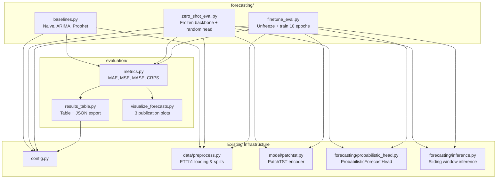
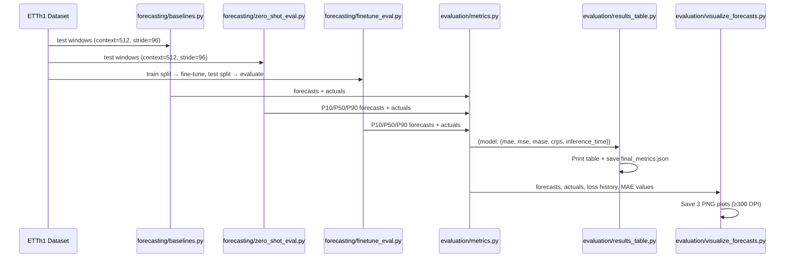

# Design Document: Evaluation Pipeline

## Overview

The evaluation pipeline orchestrates a complete benchmarking workflow for the Time-Series Foundation Model. It compares a pretrained PatchTST backbone (zero-shot and fine-tuned) against three classical baselines (Naive, ARIMA, Prophet) on the ETTh1 dataset, producing quantitative metrics, a formatted comparison table, and publication-quality visualizations.

The pipeline is structured as six modules across two packages:

1. **forecasting/baselines.py** — Naive, ARIMA (pmdarima `auto_arima`), and Prophet baseline implementations
2. **forecasting/zero_shot_eval.py** — Zero-shot transfer evaluation with frozen backbone + random LinearForecastHead
3. **forecasting/finetune_eval.py** — Fine-tuning the full backbone on ETTh1 for 10 epochs
4. **evaluation/metrics.py** — MAE, MSE, MASE, CRPS metric implementations
5. **evaluation/results_table.py** — Formatted comparison table and JSON export
6. **evaluation/visualize_forecasts.py** — Three publication-quality plots (forecast, loss curve, MAE bar chart)

### Design Rationale

The existing codebase already has partial implementations in `evaluation/baselines.py`, `evaluation/evaluate.py`, `evaluation/metrics.py`, and `evaluation/visualize.py`. The new design relocates baseline logic to `forecasting/baselines.py` (separating forecasting concerns from evaluation), creates dedicated evaluation scripts (`zero_shot_eval.py`, `finetune_eval.py`), and introduces new modules for results aggregation and enhanced visualization. The existing `evaluation/` modules remain as internal utilities; the new modules build on top of them.

Key design decisions:
- **Separation of concerns**: Forecasting logic (baselines, zero-shot, fine-tune) lives in `forecasting/`; evaluation logic (metrics, results, plots) lives in `evaluation/`.
- **Reuse existing code**: The new `forecasting/baselines.py` wraps and extends the existing `evaluation/baselines.py` functions, adding the Naive baseline and timing instrumentation.
- **Consistent windowing**: All models use identical sliding windows (context=512, horizon=96, stride=96) for fair comparison.
- **Deterministic metrics**: All metric functions are pure, stateless computations on numpy arrays.

## Architecture



### Data Flow



## Components and Interfaces

### 1. forecasting/baselines.py

This module implements three classical baselines. It wraps the existing `evaluation/baselines.py` functions and adds the Naive baseline and timing.

```python
def naive_forecast(context: np.ndarray, horizon: int = 96) -> np.ndarray:
    """Predict the last value of context for all horizon steps.
    
    Args:
        context: 1D array of historical values (length >= 1).
        horizon: Number of future steps to predict (default 96).
    
    Returns:
        1D array of shape (horizon,) filled with context[-1].
    
    Raises:
        ValueError: If context is empty (length 0).
    """

def run_naive_baseline(
    test_data: np.ndarray,
    context_length: int = 512,
    forecast_horizon: int = 96,
    stride: int = 96,
) -> dict[str, Any]:
    """Run Naive baseline on all test windows, return forecasts + metrics + timing.
    
    Returns:
        {"forecasts": np.ndarray, "metrics": {"mae", "mse", "mase"}, "inference_time": float}
    """

def run_arima_baseline_eval(
    train: np.ndarray,
    test_data: np.ndarray,
    context_length: int = 512,
    forecast_horizon: int = 96,
    stride: int = 96,
) -> dict[str, Any]:
    """Run ARIMA (pmdarima auto_arima) on all test windows.
    
    Uses pmdarima.auto_arima(max_p=5, max_d=2, max_q=5).
    Falls back to seasonal naive (period=24) on failure with warning.
    
    Returns:
        {"forecasts": np.ndarray, "metrics": {"mae", "mse", "mase"}, "inference_time": float}
    """

def run_prophet_baseline_eval(
    train: np.ndarray,
    test_data: np.ndarray,
    context_length: int = 512,
    forecast_horizon: int = 96,
    stride: int = 96,
) -> dict[str, Any]:
    """Run Prophet on all test windows.
    
    Prophet config: daily_seasonality=True, weekly_seasonality=True, yearly_seasonality=False.
    Falls back to seasonal naive (period=24) on failure with warning.
    
    Returns:
        {"forecasts": np.ndarray, "metrics": {"mae", "mse", "mase"}, "inference_time": float}
    """
```

### 2. forecasting/zero_shot_eval.py

Orchestrates zero-shot evaluation with a frozen pretrained backbone and randomly initialized LinearForecastHead.

```python
def run_zero_shot_evaluation(
    checkpoint_path: str,
    test_data: np.ndarray,
    norm_stats: dict[str, list[float]],
    train_data: np.ndarray,
    context_length: int = 512,
    forecast_horizon: int = 96,
    stride: int = 96,
    device: str = "cpu",
    output_dir: str = "forecasting/results",
) -> dict[str, Any]:
    """Load pretrained backbone, freeze weights, attach random head, evaluate.
    
    Steps:
        1. Load checkpoint, freeze all encoder params (requires_grad=False)
        2. Attach ProbabilisticForecastHead with random weights (no training)
        3. Run sliding window inference (context=512, horizon=96, stride=96)
        4. Compute MAE, MSE, MASE (P50 as point forecast), CRPS (P10/P50/P90)
        5. Measure inference time
        6. Save predictions to forecasting/results/zero_shot_predictions.csv
    
    Returns:
        {"metrics": {"mae", "mse", "mase", "crps", "inference_time"}, 
         "forecasts": np.ndarray, "actuals": np.ndarray}
    
    Raises:
        FileNotFoundError: If checkpoint_path does not exist.
    """
```

### 3. forecasting/finetune_eval.py

Fine-tunes the full pretrained backbone (all layers unfrozen) on ETTh1 for 10 epochs.

```python
def run_finetune_evaluation(
    pretrained_checkpoint_path: str,
    train_data: np.ndarray,
    val_data: np.ndarray,
    test_data: np.ndarray,
    norm_stats: dict[str, list[float]],
    device: str = "cpu",
    save_dir: str = "checkpoints",
) -> dict[str, Any]:
    """Fine-tune pretrained backbone on ETTh1 and evaluate.
    
    Steps:
        1. Load pretrained checkpoint, unfreeze ALL encoder layers
        2. Attach ProbabilisticForecastHead
        3. Train with AdamW(lr=5e-5), batch_size=32, 10 epochs
        4. Halt on NaN loss (report epoch number)
        5. Save fine-tuned checkpoint
        6. Evaluate on test split: MAE, MSE, MASE, CRPS
        7. Measure inference time on test set
    
    Returns:
        {"metrics": {"mae", "mse", "mase", "crps", "inference_time"},
         "train_losses": list[float], "val_losses": list[float],
         "epochs_completed": int, "checkpoint_path": str}
    
    Raises:
        FileNotFoundError: If pretrained checkpoint does not exist.
        RuntimeError: If NaN loss detected (includes epoch number).
    """
```

### 4. evaluation/metrics.py

Extends the existing metrics module. The current implementation already has `mae`, `mse`, `mase`, and `crps_quantile`. The design validates these meet all requirements and adds inline documentation.

```python
def mae(predictions: np.ndarray, targets: np.ndarray) -> float:
    """MAE = mean(|predictions - targets|). Always >= 0. Deterministic."""

def mse(predictions: np.ndarray, targets: np.ndarray) -> float:
    """MSE = mean((predictions - targets)^2). Always >= 0. Deterministic."""

def mase(predictions: np.ndarray, targets: np.ndarray, seasonal_period: int = 24) -> float:
    """MASE = MAE / naive_MAE. Returns inf if naive_MAE == 0. seasonal_period=24."""

def crps_quantile(q_predictions: np.ndarray, targets: np.ndarray, quantiles: list[float]) -> float:
    """CRPS ≈ (2/K) * Σ pinball_loss(q_k, y, tau_k). Uses P10/P50/P90."""
```

### 5. evaluation/results_table.py

New module for formatted output and JSON persistence.

```python
def format_results_table(
    results: dict[str, dict[str, float]],
) -> str:
    """Format a comparison table string with columns: Model, MAE, MSE, MASE, CRPS, Inference_Time.
    
    Row order: Naive, ARIMA, Prophet, PatchTST (zero-shot), PatchTST (fine-tuned).
    CRPS shows "N/A" for point-forecast baselines.
    Inference_Time uses human-readable units (<1ms, ~Xs, ~Xms).
    """

def print_results_table(results: dict[str, dict[str, float]]) -> None:
    """Print the formatted table to stdout."""

def save_results_json(
    results: dict[str, dict[str, float]],
    output_path: str = "evaluation/results/final_metrics.json",
) -> None:
    """Save results as JSON with model names as keys, metrics rounded to 4 decimal places.
    
    Creates output directory if it does not exist.
    """
```

### 6. evaluation/visualize_forecasts.py

New module for three publication-quality plots.

```python
def plot_forecast(
    actual: np.ndarray,
    p50: np.ndarray,
    p10: np.ndarray,
    p90: np.ndarray,
    window_index: int,
    dataset_name: str = "ETTh1",
    output_dir: str = "evaluation/results",
    dpi: int = 300,
) -> str:
    """Generate forecast plot: actual (solid) vs P50 (dashed) with P10-P90 shading.
    
    Returns path to saved PNG file.
    Raises ValueError if array lengths differ.
    """

def plot_loss_curve(
    domain_losses: dict[str, list[float]],
    output_dir: str = "evaluation/results",
    dpi: int = 300,
) -> str:
    """Plot pretraining loss curves for Energy, Weather, Finance domains.
    
    Omits domains with zero epochs of data.
    Saves to evaluation/results/pretraining_loss_curve.png.
    Returns path to saved PNG file.
    """

def plot_mae_bar_chart(
    model_maes: dict[str, float],
    output_dir: str = "evaluation/results",
    dpi: int = 300,
) -> str:
    """Bar chart comparing MAE across all 5 models.
    
    Order: Naive, ARIMA, Prophet, PatchTST zero-shot, PatchTST fine-tuned.
    Baseline bars in one color, PatchTST bars in another.
    Value labels on top (4 decimal places).
    Saves to evaluation/results/mae_comparison_bar_chart.png.
    Returns path to saved PNG file.
    """
```

## Data Models

### Metric Result Dictionary

All model evaluations produce a standardized result dictionary:

```python
MetricResult = {
    "mae": float,        # Mean Absolute Error (>= 0)
    "mse": float,        # Mean Squared Error (>= 0)
    "mase": float,       # Mean Absolute Scaled Error (seasonal_period=24)
    "crps": float | None,  # CRPS (None for point-forecast baselines)
    "inference_time": float,  # Wall-clock seconds (>= 0, 2 decimal places)
}
```

### Final Metrics JSON Schema

Saved to `evaluation/results/final_metrics.json`:

```json
{
    "Naive": {"mae": 0.1234, "mse": 0.0567, "mase": 1.0000, "crps": null, "inference_time": 0.01},
    "ARIMA": {"mae": 0.1100, "mse": 0.0450, "mase": 0.8900, "crps": null, "inference_time": 45.23},
    "Prophet": {"mae": 0.1050, "mse": 0.0420, "mase": 0.8500, "crps": null, "inference_time": 120.56},
    "PatchTST (zero-shot)": {"mae": 0.0950, "mse": 0.0380, "mase": 0.7700, "crps": 0.0650, "inference_time": 2.34},
    "PatchTST (fine-tuned)": {"mae": 0.0750, "mse": 0.0280, "mase": 0.6100, "crps": 0.0450, "inference_time": 2.45}
}
```

### Zero-Shot Predictions CSV Schema

Saved to `forecasting/results/zero_shot_predictions.csv`:

| Column | Type | Description |
|--------|------|-------------|
| window_index | int | Test window index (0-based) |
| time_step | int | Forecast step within window (0-95) |
| actual | float | Ground truth value (original scale) |
| P10 | float | 10th percentile prediction |
| P50 | float | 50th percentile (median) prediction |
| P90 | float | 90th percentile prediction |

### Configuration Parameters (from config.py)

| Parameter | Value | Usage |
|-----------|-------|-------|
| CONTEXT_LENGTH | 512 | Input window size for all models |
| FORECAST_HORIZON | 96 | Prediction length for all models |
| D_MODEL | 256 | Encoder hidden dimension |
| NUM_PATCHES | 63 | Number of patches from encoder |
| QUANTILES | [0.1, 0.5, 0.9] | P10/P50/P90 quantile levels |
| FINETUNE_LR | 5e-5 | Fine-tune learning rate (AdamW) |
| FINETUNE_BATCH_SIZE | 32 | Fine-tune batch size |
| FINETUNE_EPOCHS | 10 | Fine-tune epoch count |
| MASE seasonal_period | 24 | Hourly data, daily seasonality |

## Correctness Properties

*A property is a characteristic or behavior that should hold true across all valid executions of a system — essentially, a formal statement about what the system should do. Properties serve as the bridge between human-readable specifications and machine-verifiable correctness guarantees.*

### Property 1: Naive forecast produces constant array of last context value

*For any* non-empty context window (length >= 1) containing finite numeric values, the Naive baseline forecast SHALL produce an array of exactly 96 elements where every element equals the final value of the context window.

**Validates: Requirements 1.1**

### Property 2: Baseline forecast output length invariant

*For any* valid time series input window of sufficient length, both the ARIMA and Prophet baseline forecasters SHALL produce a point forecast array of exactly `forecast_horizon` (96) elements, regardless of the input data distribution or values (including when fallback to seasonal naive is triggered).

**Validates: Requirements 2.2, 3.2**

### Property 3: Zero-shot inference output shape

*For any* normalized test data array of length >= context_length + forecast_horizon (608), the zero-shot evaluator SHALL produce an output array of shape `(num_windows, 96, 3)` where `num_windows = floor((len(data) - 512 - 96) / 96) + 1`, and the three channels correspond to P10, P50, P90 quantile predictions.

**Validates: Requirements 4.5**

### Property 4: MAE equals reference computation

*For any* two equal-shape numpy arrays of finite numeric values, `mae(predictions, targets)` SHALL equal `np.mean(np.abs(predictions - targets))` to floating-point precision.

**Validates: Requirements 6.1**

### Property 5: MSE is non-negative and equals reference computation

*For any* two equal-shape numpy arrays of finite numeric values, `mse(predictions, targets)` SHALL equal `np.mean((predictions - targets) ** 2)` and the result SHALL always be greater than or equal to zero.

**Validates: Requirements 6.2**

### Property 6: MASE scaling relationship

*For any* predictions array, targets array (both of length > seasonal_period), and seasonal_period > 0, `mase(predictions, targets, seasonal_period)` SHALL equal `mean(|pred - target|) / mean(|target[sp:] - target[:-sp]|)` where `sp` is the seasonal period, provided the denominator is non-zero.

**Validates: Requirements 6.3**

### Property 7: CRPS equals scaled pinball loss sum

*For any* quantile predictions array of shape (..., K) and targets array of matching shape (...), and quantile levels list of length K, `crps_quantile(q_predictions, targets, quantiles)` SHALL equal `(2/K) * sum(mean(pinball_loss(q_k, targets, tau_k)) for k in range(K))`.

**Validates: Requirements 6.5**

### Property 8: Metric functions are deterministic

*For any* valid input arrays, calling any metric function (mae, mse, mase, crps_quantile) twice with identical inputs SHALL produce identical floating-point results.

**Validates: Requirements 6.7**

### Property 9: JSON results round-trip preserves structure and precision

*For any* valid results dictionary with model names as string keys and metric values as floats, saving to JSON via `save_results_json` and loading back SHALL produce a dictionary where all numeric values are rounded to exactly 4 decimal places and all model name keys are preserved.

**Validates: Requirements 7.3**

### Property 10: Loss curve gracefully omits empty domains

*For any* domain losses dictionary where some domains have empty loss lists (zero epochs) and at least one domain has non-empty data, `plot_loss_curve` SHALL produce a valid plot file without error, rendering only the domains that have at least one epoch of data.

**Validates: Requirements 9.4**

## Error Handling

| Scenario | Module | Behavior |
|----------|--------|----------|
| Empty context window (length 0) | forecasting/baselines.py | Raise `ValueError` with message about minimum 1 value required |
| Missing pretrained checkpoint | forecasting/zero_shot_eval.py | Raise `FileNotFoundError` with checkpoint path, no partial results |
| Missing pretrained checkpoint | forecasting/finetune_eval.py | Raise `FileNotFoundError` with checkpoint path, abort without training |
| ARIMA fitting failure | forecasting/baselines.py | Fall back to seasonal naive (period=24), log warning with window index and exception type |
| Prophet fitting failure | forecasting/baselines.py | Fall back to seasonal naive (period=24), log warning with window index and error type |
| NaN loss during fine-tuning | forecasting/finetune_eval.py | Halt training immediately, raise `RuntimeError` reporting the epoch number |
| Mismatched array lengths in plot | evaluation/visualize_forecasts.py | Raise `ValueError` indicating dimension mismatch |
| Output directory does not exist | evaluation/results_table.py, evaluation/visualize_forecasts.py | Create directory with `os.makedirs(exist_ok=True)` |
| All domains have empty loss data | evaluation/visualize_forecasts.py | Produce empty plot or skip rendering gracefully |

## Testing Strategy

### Property-Based Testing

This feature is well-suited for property-based testing because the core metric functions are pure computations with clear mathematical definitions, and the forecasting modules have well-defined input/output contracts.

**Library**: [Hypothesis](https://hypothesis.readthedocs.io/) (Python PBT library, already present in the project's `.hypothesis/` directory)

**Configuration**: Minimum 100 iterations per property test (`@settings(max_examples=100)`)

**Tag format**: Each property test includes a comment referencing the design property:
```python
# Feature: evaluation-pipeline, Property 1: Naive forecast produces constant array of last context value
```

### Property Tests (10 properties)

| Property | Module Under Test | Generator Strategy |
|----------|-------------------|-------------------|
| P1: Naive constant output | forecasting/baselines.py | Random float arrays (length 1-1000) |
| P2: Baseline output length | forecasting/baselines.py | Random time series (length 512+) |
| P3: Zero-shot output shape | forecasting/zero_shot_eval.py | Random normalized arrays (length 608-2000) |
| P4: MAE reference | evaluation/metrics.py | Random equal-shape float arrays |
| P5: MSE non-negative + reference | evaluation/metrics.py | Random equal-shape float arrays |
| P6: MASE scaling | evaluation/metrics.py | Random arrays (length > 24) |
| P7: CRPS pinball formula | evaluation/metrics.py | Random quantile predictions + targets |
| P8: Metric determinism | evaluation/metrics.py | Random arrays, call twice |
| P9: JSON round-trip | evaluation/results_table.py | Random results dictionaries |
| P10: Loss curve domain omission | evaluation/visualize_forecasts.py | Random domain loss dicts with some empty |

### Unit Tests (Example-Based)

| Test | Module | What it verifies |
|------|--------|-----------------|
| Empty context raises ValueError | forecasting/baselines.py | Requirement 1.2 |
| ARIMA fallback on failure | forecasting/baselines.py | Requirement 2.5 |
| Prophet fallback on failure | forecasting/baselines.py | Requirement 3.5 |
| Missing checkpoint raises error | forecasting/zero_shot_eval.py | Requirement 4.2 |
| NaN loss halts training | forecasting/finetune_eval.py | Requirement 5.7 |
| MASE returns inf for zero denominator | evaluation/metrics.py | Requirement 6.4 |
| Results table row order | evaluation/results_table.py | Requirement 7.2 |
| CRPS shows N/A for baselines | evaluation/results_table.py | Requirement 7.4 |
| Forecast plot dimension mismatch error | evaluation/visualize_forecasts.py | Requirement 8.5 |
| Plot saved at 300 DPI | evaluation/visualize_forecasts.py | Requirement 8.3 |

### Integration Tests

| Test | Scope | What it verifies |
|------|-------|-----------------|
| Full naive evaluation on sample data | forecasting/baselines.py | Requirement 1.3, 1.4 |
| Full ARIMA evaluation on sample data | forecasting/baselines.py | Requirement 2.3, 2.4 |
| Zero-shot pipeline end-to-end | forecasting/zero_shot_eval.py | Requirements 4.1-4.9 |
| Fine-tune pipeline end-to-end | forecasting/finetune_eval.py | Requirements 5.1-5.5 |
| Results table + JSON save | evaluation/results_table.py | Requirements 7.1-7.5 |
| All 3 plots generated | evaluation/visualize_forecasts.py | Requirements 8-10 |

