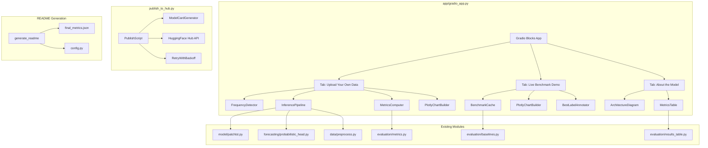

# Design Document: Gradio Demo & HuggingFace Publish

## Overview

This feature delivers three integrated deliverables: a multi-tab Gradio application (`app/gradio_app.py`) with interactive Plotly charts, a HuggingFace Hub publishing script (`publish_to_hub.py`), and a comprehensive README generator. The Gradio app replaces the existing single-tab matplotlib-based `app/app.py` with a three-tab interface supporting CSV upload with frequency detection, live benchmark comparisons against ARIMA/Prophet baselines, and a model information tab. The publishing script automates model upload and Space deployment. The README generator produces a portfolio-ready project description from computed metrics.

The design reuses existing project modules extensively:
- `model/patchtst.py` — PatchTSTModel encoder backbone
- `forecasting/probabilistic_head.py` — ProbabilisticForecastHead for quantile output
- `forecasting/inference.py` — zero-shot inference pipeline
- `evaluation/metrics.py` — MAE, MSE, MASE, CRPS computation
- `evaluation/baselines.py` — ARIMA and Prophet baseline runners
- `evaluation/results_table.py` — results formatting and JSON export
- `data/preprocess.py` — normalization utilities
- `config.py` — all hyperparameters

## Architecture



## Components and Interfaces

### 1. FrequencyDetector (`app/gradio_app.py`)

Detects time series frequency from timestamp intervals.

```python
def detect_frequency(timestamps: pd.Series) -> tuple[str, str | None]:
    """Detect frequency from a datetime series.
    
    Computes the median interval between consecutive timestamps and classifies
    to the nearest supported frequency using tolerance bands:
      - Hourly: median interval in [30min, 90min]
      - Daily: median interval in [12h, 36h]  
      - Weekly: median interval in [5d, 9d]
    
    Args:
        timestamps: A pandas Series of datetime values (sorted ascending).
    
    Returns:
        A tuple of (frequency_label, warning_message).
        frequency_label: One of "hourly", "daily", "weekly".
        warning_message: None if detected cleanly, or a string warning if
                         defaulting to daily due to unrecognized interval.
    """
```

### 2. InferencePipeline (`app/gradio_app.py`)

Wraps model loading, caching, normalization, and forecast generation.

```python
class ModelCache:
    """Singleton cache for the PatchTST model and forecast head.
    
    Loads the model once at startup with a 60-second timeout.
    Falls back to random weights if checkpoint is missing/corrupt/slow.
    """
    _model: PatchTSTModel | None = None
    _head: ProbabilisticForecastHead | None = None
    _warning: str | None = None
    
    @classmethod
    def get_model(cls) -> tuple[PatchTSTModel, ProbabilisticForecastHead, str | None]:
        """Return cached model, head, and any warning message."""

def run_forecast(
    series: np.ndarray,
    horizon: int,
    model: PatchTSTModel,
    head: ProbabilisticForecastHead,
) -> np.ndarray:
    """Run inference on the last 512 steps of a numeric series.
    
    Args:
        series: 1D array of numeric values (length >= 512).
        horizon: Forecast steps (24, 48, 96, or 192).
        model: Loaded PatchTSTModel.
        head: ProbabilisticForecastHead (may be custom for non-96 horizons).
    
    Returns:
        Array of shape (horizon, 3) with [P10, P50, P90] in original scale.
    """
```

### 3. PlotlyChartBuilder (`app/gradio_app.py`)

Builds interactive Plotly figures for both tabs.

```python
def build_forecast_chart(
    context: np.ndarray,
    p10: np.ndarray,
    p50: np.ndarray,
    p90: np.ndarray,
    target_col: str,
    horizon: int,
    actuals: np.ndarray | None = None,
    metrics: dict[str, float] | None = None,
) -> go.Figure:
    """Build a Plotly figure for the Upload tab forecast.
    
    Traces:
      - Historical context: blue solid line
      - P50 forecast: orange dashed line
      - P10-P90 band: light orange shaded fill
      - Actuals (if available): green dotted line
    """

def build_benchmark_chart(
    ground_truth: np.ndarray,
    arima_forecast: np.ndarray,
    prophet_forecast: np.ndarray,
    patchtst_p10: np.ndarray,
    patchtst_p50: np.ndarray,
    patchtst_p90: np.ndarray,
    mae_values: dict[str, float],
) -> go.Figure:
    """Build a Plotly figure for the Benchmark tab comparison.
    
    Traces: ground truth, ARIMA, Prophet, PatchTST P50 + P10-P90 band.
    Legend entries include MAE values; best method gets a ★ indicator.
    """
```

### 4. BenchmarkCache (`app/gradio_app.py`)

Pre-computes and caches baseline forecasts for 10 ETTh1 samples.

```python
class BenchmarkCache:
    """Stores pre-computed forecasts for 10 ETTh1 test samples.
    
    Loaded from a JSON/NPZ cache file at startup. If cache doesn't exist,
    computes forecasts using evaluation/baselines.py and saves the cache.
    
    Attributes:
        samples: list of 10 dicts, each containing:
            - start_index: int (starting index in test split)
            - ground_truth: np.ndarray (96,)
            - arima_forecast: np.ndarray (96,)
            - prophet_forecast: np.ndarray (96,)
            - patchtst_p10: np.ndarray (96,)
            - patchtst_p50: np.ndarray (96,)
            - patchtst_p90: np.ndarray (96,)
            - mae: dict[str, float] (per-method MAE)
    """
    CACHE_PATH = "app/benchmark_cache.npz"
    NUM_SAMPLES = 10
```

### 5. ModelCardGenerator (`publish_to_hub.py`)

Generates HuggingFace model card markdown.

```python
def generate_model_card(
    model_name: str,
    param_count: int,
    domains: dict[str, int],  # domain_name -> row_count
    metrics: dict[str, dict[str, float]],
    github_url: str,
) -> str:
    """Generate a Model_Card markdown string.
    
    Sections: model name + architecture summary, pretraining domains,
    benchmark results table, 5-line Python usage example, GitHub link.
    
    Returns:
        Complete model card as a markdown string.
    """
```

### 6. RetryWithBackoff (`publish_to_hub.py`)

Retry decorator for network operations.

```python
def retry_with_backoff(
    func: Callable,
    max_retries: int = 3,
    base_delay: float = 2.0,
) -> Any:
    """Execute func with exponential backoff retry on network errors.
    
    Retries up to max_retries times. Delay doubles each retry:
    2s, 4s, 8s. Raises the last exception if all retries fail.
    """
```

### 7. PublishScript (`publish_to_hub.py`)

Main orchestrator for HuggingFace Hub publishing.

```python
def publish_all(
    hf_token: str,
    pretrained_path: str = "checkpoints/pretrained_patchtst.pt",
    finetuned_path: str = "checkpoints/finetuned_patchtst.pt",
) -> None:
    """Push models and deploy Space to HuggingFace Hub.
    
    Steps:
    1. Resolve username via HF Hub API whoami
    2. Push pretrained checkpoint + model card
    3. Push fine-tuned checkpoint + model card
    4. Deploy Gradio Space with app source + requirements.txt
    """
```

### 8. README Generator (`generate_readme.py` or inline in publish script)

```python
def generate_readme(
    metrics_path: str = "evaluation/results/final_metrics.json",
    config: type = Config,
) -> str:
    """Generate the final README.md content.
    
    Sections: What This Is (3 sentences), Architecture Diagram,
    Results Table, Pretraining Details, How to Reproduce (8 steps),
    Resume Bullet, Links.
    """
```

## Data Models

### FrequencyDetection Result

```python
@dataclass
class FrequencyResult:
    frequency: str  # "hourly" | "daily" | "weekly"
    median_interval_seconds: float
    warning: str | None  # None if clean detection, warning string if defaulted
```

### BenchmarkSample

```python
@dataclass
class BenchmarkSample:
    start_index: int
    ground_truth: np.ndarray      # shape (96,)
    arima_forecast: np.ndarray    # shape (96,)
    prophet_forecast: np.ndarray  # shape (96,)
    patchtst_p10: np.ndarray      # shape (96,)
    patchtst_p50: np.ndarray      # shape (96,)
    patchtst_p90: np.ndarray      # shape (96,)
    mae_scores: dict[str, float]  # {"ARIMA": x, "Prophet": y, "PatchTST": z}
```

### PublishConfig

```python
@dataclass
class PublishConfig:
    hf_token: str
    username: str  # resolved from HF API
    pretrained_repo: str  # "{username}/patchtst-foundation-pretrained"
    finetuned_repo: str   # "{username}/patchtst-etth1-finetuned"
    space_repo: str       # "{username}/timeseries-foundation-demo"
    pretrained_checkpoint: str  # "checkpoints/pretrained_patchtst.pt"
    finetuned_checkpoint: str   # "checkpoints/finetuned_patchtst.pt"
```

### Frequency Detection Tolerance Bands

| Frequency | Min Interval | Max Interval | Median Target |
|-----------|-------------|-------------|---------------|
| Hourly    | 30 minutes  | 90 minutes  | 60 minutes    |
| Daily     | 12 hours    | 36 hours    | 24 hours      |
| Weekly    | 5 days      | 9 days      | 7 days        |

If the median interval falls outside all bands, default to "daily" with a warning.

## Correctness Properties

*A property is a characteristic or behavior that should hold true across all valid executions of a system — essentially, a formal statement about what the system should do. Properties serve as the bridge between human-readable specifications and machine-verifiable correctness guarantees.*

### Property 1: Frequency detection correctness

*For any* array of timestamps with a known ground-truth frequency (hourly, daily, or weekly) and any amount of jitter within the tolerance band, the FrequencyDetector SHALL classify the frequency correctly. *For any* array of timestamps whose median interval falls outside all tolerance bands, the FrequencyDetector SHALL return "daily" as the default with a non-None warning message.

**Validates: Requirements 1.1, 1.9**

### Property 2: Inference output validity

*For any* valid numeric array of length >= 512 and any supported forecast horizon (24, 48, 96, 192), the inference pipeline SHALL produce an output array of shape (horizon, 3) where for each time step t, P10[t] <= P50[t] <= P90[t] (quantile ordering is preserved).

**Validates: Requirements 1.3**

### Property 3: Metrics availability detection

*For any* CSV with a numeric column of length L >= 512 and a forecast horizon H, if L >= 512 + H then MAE and MASE metrics SHALL be computed and returned as finite positive floats; if L < 512 + H then no metrics SHALL be computed (metrics result is None).

**Validates: Requirements 1.5**

### Property 4: Best method identification

*For any* dictionary of method names to MAE values (with at least 2 methods), the best-label annotator SHALL append the best-indicator label to exactly one method — the one with the strictly lowest MAE value.

**Validates: Requirements 2.3**

### Property 5: Model card completeness

*For any* valid model name, parameter count, domain dictionary with row counts, metrics dictionary, and GitHub URL, the generated model card SHALL contain all required sections: model name, architecture summary with parameter count, each domain name with its row count, a benchmark results table, a Python usage example of at least 5 lines, and the GitHub URL.

**Validates: Requirements 4.4**

### Property 6: Retry with exponential backoff

*For any* function that fails N times (0 <= N <= 3) before succeeding, the retry mechanism SHALL attempt exactly min(N+1, 4) calls total. If N >= 3 (all retries exhausted), it SHALL raise the last exception. The delay between attempt k and attempt k+1 SHALL be base_delay * 2^k seconds (2s, 4s, 8s).

**Validates: Requirements 4.6**

### Property 7: README "What This Is" constraints

*For any* set of input metrics, the generated "What This Is" section SHALL contain exactly 3 sentences (delimited by periods followed by space or end-of-section), each sentence SHALL contain no more than 25 words, and no domain-specific acronym SHALL appear without an inline definition.

**Validates: Requirements 5.1**

### Property 8: Results table formatting

*For any* metrics dictionary containing entries for Naive, ARIMA, Prophet, PatchTST (zero-shot), and PatchTST (fine-tuned), the generated results table SHALL have columns MAE, MSE, MASE, CRPS; rows in the order Naive, ARIMA, Prophet, PatchTST (zero-shot), PatchTST (fine-tuned); all numeric values rounded to exactly 4 decimal places; and "N/A" displayed for CRPS on Naive, ARIMA, and Prophet rows.

**Validates: Requirements 5.3**

### Property 9: README reproduction steps count

*For any* generated README, the "How to Reproduce" section SHALL contain exactly 8 numbered commands, each being a non-empty string that starts with a valid shell command prefix (pip, python, bash) or a Python module invocation.

**Validates: Requirements 5.5**

### Property 10: Resume bullet metric inclusion

*For any* metrics dictionary containing PatchTST (zero-shot) MAE and at least one baseline MAE, the generated resume bullet SHALL contain the PatchTST zero-shot MAE value (formatted to 4 decimal places) and at least one baseline MAE value as a comparative statement.

**Validates: Requirements 5.6**

### Property 11: Model caching idempotence

*For any* sequence of N calls (N >= 2) to ModelCache.get_model(), all calls SHALL return the identical model object (same Python object identity), and the model SHALL be loaded from disk at most once.

**Validates: Requirements 6.3**

## Error Handling

### CSV Upload Validation Errors

| Condition | Error Message | Behavior |
|-----------|--------------|----------|
| < 512 rows | "File must contain at least 512 data rows" | Return error, no inference |
| No numeric columns | "At least one numeric column is required" | Return error, no inference |
| No datetime column | "A datetime column is required for frequency detection" | Return error, no inference |
| Unrecognized frequency | Warning: "Assumed daily frequency" | Proceed with daily default |

### Model Loading Errors

| Condition | Behavior |
|-----------|----------|
| No checkpoint file found | Initialize random weights, show warning banner |
| Checkpoint corrupt/incompatible | Initialize random weights, show warning banner |
| Loading exceeds 60 seconds | Abort, initialize random weights, show timeout warning |

### Publishing Errors

| Condition | Behavior |
|-----------|----------|
| HF_TOKEN not set/empty | Print error to stderr, exit code 1 |
| Checkpoint file missing | Print error identifying file, exit code 1 |
| Network error (upload) | Retry 3x with exponential backoff (2s, 4s, 8s), then fail |
| All retries exhausted | Print failure reason to stderr, exit code 1 |

### Graceful Degradation Strategy

The Gradio app prioritizes availability over correctness:
1. Missing checkpoint → app still launches with random weights + warning
2. Benchmark cache missing → compute on first access (slower but functional)
3. Plotly rendering failure → fall back to error message in status box

## Testing Strategy

### Property-Based Testing

This feature is suitable for property-based testing. The frequency detection, inference pipeline, model card generation, retry logic, and README generation all involve pure functions with clear input/output behavior and universal properties that hold across wide input spaces.

**Library:** [Hypothesis](https://hypothesis.readthedocs.io/) (Python PBT library)

**Configuration:** Minimum 100 iterations per property test.

**Tag format:** `Feature: gradio-demo-publish, Property {number}: {property_text}`

Each correctness property (1-11) maps to a single property-based test:

| Property | Test Target | Generator Strategy |
|----------|-------------|-------------------|
| 1 | `detect_frequency()` | Random timestamp arrays with known frequencies + jitter |
| 2 | `run_forecast()` | Random float arrays of length 512-2048, horizons from {24,48,96,192} |
| 3 | Metrics availability logic | Random arrays of length 512-1024, random horizons |
| 4 | Best-label annotator | Random dicts of 2-5 methods with random positive MAE floats |
| 5 | `generate_model_card()` | Random strings, ints, dicts with valid structure |
| 6 | `retry_with_backoff()` | Random failure counts 0-4, mock functions |
| 7 | README "What This Is" | Random metric inputs |
| 8 | Results table formatter | Random metric dicts with 5 models |
| 9 | README "How to Reproduce" | Random config inputs |
| 10 | Resume bullet generator | Random metric dicts |
| 11 | `ModelCache.get_model()` | Multiple sequential calls |

### Unit Tests (Example-Based)

- Tab structure: verify exactly 3 tabs with correct labels (Req 6.1)
- Horizon options: verify dropdown contains [24, 48, 96, 192] (Req 1.2)
- Chart styling: verify Plotly traces have correct colors/styles (Req 1.4)
- Benchmark dropdown: verify 10 samples listed (Req 2.1)
- About tab content: verify ASCII diagram, domains, metrics table, links (Req 3.1-3.4)
- README links section: verify exactly 4 URLs (Req 5.7)

### Integration Tests

- HF Hub publishing with mocked API (Req 4.1-4.3, 4.8)
- End-to-end CSV upload → forecast → chart rendering
- Benchmark cache generation from ETTh1 data

### Edge Case Tests (covered by property generators)

- CSV with exactly 512 rows (boundary)
- CSV with 511 rows (just under minimum)
- CSV with no numeric columns
- CSV with no datetime column
- Missing/corrupt checkpoint files
- Empty HF_TOKEN
- All network retries exhausted
