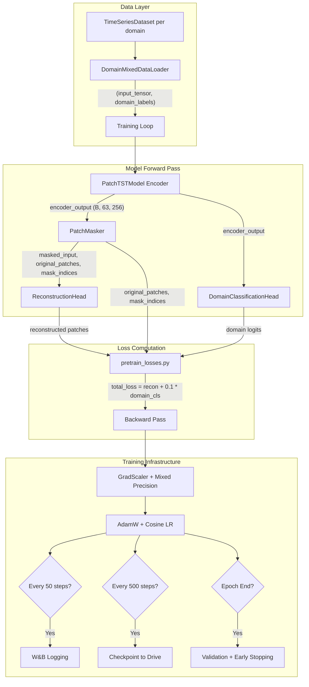

# Design Document: Enhanced Pretraining Loop

## Overview

This design enhances the existing PatchTST pretraining pipeline by adding domain classification as an auxiliary task, weighted domain sampling, mixed precision training (fp16), Weights & Biases logging, early stopping, HuggingFace Hub integration, and step-based checkpointing. The enhanced loop lives in `pretraining/pretrain_loop.py` and orchestrates multi-task training (reconstruction + domain classification) across Energy, Weather, and Finance domains.

The existing `pretraining/train.py` remains unchanged for backward compatibility. The new module provides a production-grade training loop with modern ML engineering practices suitable for Colab T4 GPU training.

### Key Design Decisions

1. **Separate module** (`pretrain_loop.py`) rather than modifying `train.py` — preserves existing functionality and allows A/B comparison.
2. **Step-based logging and checkpointing** — aligns with modern training practices where epochs are less meaningful for large datasets.
3. **Graceful degradation** — W&B, Google Drive, and HuggingFace Hub are all optional; training continues if any external service is unavailable.
4. **Multi-task loss with fixed weighting** — domain classification weight (0.1) is small enough to not dominate reconstruction learning.

## Architecture



### Training Flow

1. `DomainMixedDataLoader` produces mixed batches with weighted sampling (40/30/30).
2. Each batch passes through the encoder, then branches to masking (for reconstruction) and domain classification.
3. Multi-task loss combines MSE reconstruction loss with cross-entropy domain classification loss.
4. Mixed precision (`torch.autocast` + `GradScaler`) wraps the forward pass.
5. Gradient accumulation (4 steps) produces effective batch size of 128.
6. Step-based logging (every 50 steps) and checkpointing (every 500 steps) provide observability and fault tolerance.
7. Early stopping (patience=5) monitors validation loss to prevent overfitting.

## Components and Interfaces

### 1. DomainClassificationHead (in `pretraining/pretrain_losses.py`)

```python
class DomainClassificationHead(nn.Module):
    """Predicts domain from encoder output via global average pooling + linear."""
    
    def __init__(self, d_model: int = 256, num_domains: int = 3):
        # Global average pooling across patch dimension + linear projection
        self.classifier = nn.Linear(d_model, num_domains)
    
    def forward(self, encoder_output: torch.Tensor) -> torch.Tensor:
        """
        Args:
            encoder_output: (batch_size, num_patches, d_model)
        Returns:
            domain_logits: (batch_size, num_domains) — unnormalized logits
        Raises:
            ValueError: if encoder_output.shape[-1] != d_model
        """
```

### 2. compute_pretrain_loss (in `pretraining/pretrain_losses.py`)

```python
def compute_pretrain_loss(
    reconstructed: torch.Tensor,       # (B, num_patches, patch_len)
    original_patches: torch.Tensor,    # (B, num_patches, d_model)
    mask_indices: torch.Tensor,        # (B, num_masked)
    domain_logits: torch.Tensor,       # (B, num_domains)
    domain_labels: torch.Tensor,       # (B,)
    domain_loss_weight: float = 0.1,
) -> dict[str, torch.Tensor]:
    """
    Returns:
        {
            "reconstruction_loss": scalar tensor,
            "domain_classification_loss": scalar tensor,
            "total_loss": recon + 0.1 * domain_cls
        }
    Raises:
        ValueError: if domain_labels contains values outside [0, num_domains-1]
    """
```

### 3. DomainMixedDataLoader (in `data/dataset.py`)

```python
class DomainMixedDataLoader:
    """Weighted domain sampling with configurable ratios."""
    
    def __init__(
        self,
        datasets: list[TimeSeriesDataset],
        domain_weights: dict[str, float],  # {"energy": 0.4, "weather": 0.3, "finance": 0.3}
        batch_size: int = 32,
        domain_names: list[str] = ["energy", "weather", "finance"],
    ):
        ...
    
    def __iter__(self) -> Iterator[tuple[torch.Tensor, torch.Tensor]]:
        """Yields (input_tensor, domain_labels) batches."""
```

### 4. Enhanced PatchMasker.mask_patches (in `pretraining/masking.py`)

```python
def mask_patches(
    self, patch_embeddings: torch.Tensor
) -> tuple[torch.Tensor, torch.Tensor, torch.Tensor]:
    """
    Returns:
        - masked_input: (B, num_patches, d_model) with mask token at masked positions
        - original_patches: (B, num_patches, d_model) cloned, detached copy of input
        - mask_indices: (B, num_masked) sorted integer indices
    """
```

### 5. pretrain_enhanced (in `pretraining/pretrain_loop.py`)

```python
def pretrain_enhanced(
    model: PatchTSTModel,
    train_datasets: list[TimeSeriesDataset],
    val_datasets: list[TimeSeriesDataset],
    config: type = Config,
    device: Optional[torch.device] = None,
    domain_names: Optional[list[str]] = None,
    resume_checkpoint: Optional[str] = None,
) -> dict:
    """
    Full enhanced pretraining loop with:
    - Multi-task loss (reconstruction + domain classification)
    - Mixed precision (fp16 on CUDA, fp32 on CPU)
    - Gradient accumulation (4 steps)
    - AdamW + cosine LR with warmup
    - W&B logging every 50 optimizer steps
    - Checkpointing every 500 optimizer steps
    - Early stopping (patience=5)
    - HuggingFace Hub push on completion
    
    Returns:
        Training history dict with losses, metrics, and metadata.
    """
```

## Data Models

### Config Additions

```python
# In config.py — new attributes for enhanced pretraining
DOMAIN_WEIGHTS: dict = {"energy": 0.4, "weather": 0.3, "finance": 0.3}
DOMAIN_LOSS_WEIGHT: float = 0.1
NUM_DOMAINS: int = 3
LOG_EVERY_N_STEPS: int = 50
CHECKPOINT_EVERY_N_STEPS: int = 500
MAX_CHECKPOINTS: int = 5
EARLY_STOPPING_PATIENCE: int = 5
EARLY_STOPPING_MIN_DELTA: float = 1e-4
WANDB_PROJECT: str = "time-series-foundation-model"
HF_REPO_NAME: str = "patchtst-foundation-pretrained"
CHECKPOINT_DIR: str = "checkpoints"
GDRIVE_CHECKPOINT_DIR: str = "/content/drive/MyDrive/checkpoints"
```

### Checkpoint Schema

```python
checkpoint = {
    "model_state_dict": model.state_dict(),
    "optimizer_state_dict": optimizer.state_dict(),
    "scaler_state_dict": scaler.state_dict(),
    "scheduler_state_dict": scheduler.state_dict(),
    "epoch": int,
    "global_step": int,
    "best_val_loss": float,
}
```

### Training History Return Value

```python
history = {
    "train_losses": list[float],          # per-epoch average
    "val_losses": list[float],            # per-epoch average
    "learning_rates": list[float],        # per-epoch
    "domain_accuracies": dict[str, float], # final per-domain accuracy
    "epochs_completed": int,
    "global_steps_completed": int,
    "stopped_early": bool,
    "best_epoch": int,
}
```

### Pretraining Log JSON Schema

```json
{
    "final_train_loss": 0.0123,
    "final_val_loss": 0.0145,
    "train_losses": [0.05, 0.03, ...],
    "val_losses": [0.06, 0.04, ...],
    "epochs_completed": 15,
    "stopped_early": true,
    "domain_accuracies": {
        "energy": 0.92,
        "weather": 0.88,
        "finance": 0.85
    }
}
```

## Correctness Properties

*A property is a characteristic or behavior that should hold true across all valid executions of a system — essentially, a formal statement about what the system should do. Properties serve as the bridge between human-readable specifications and machine-verifiable correctness guarantees.*

### Property 1: Domain Classification Head Computation

*For any* encoder output tensor of shape (batch_size, num_patches, d_model), the DomainClassificationHead output SHALL equal `classifier(mean(input, dim=1))` — i.e., global average pooling followed by linear projection — producing a tensor of shape (batch_size, num_domains) that is directly compatible with `F.cross_entropy` loss computation.

**Validates: Requirements 1.1, 1.2, 1.6**

### Property 2: Domain Classification Head Input Validation

*For any* input tensor whose last dimension does not equal d_model, the DomainClassificationHead SHALL raise a ValueError with a descriptive message indicating the expected and received dimensions.

**Validates: Requirements 1.5**

### Property 3: Reconstruction Loss Ignores Unmasked Positions

*For any* set of predictions, targets, and mask indices, modifying the values at unmasked positions in either predictions or targets SHALL NOT change the computed reconstruction loss. Only masked positions contribute to the loss.

**Validates: Requirements 2.1**

### Property 4: Domain Classification Loss Matches Cross-Entropy

*For any* set of domain logits of shape (batch_size, num_domains) and valid domain labels of shape (batch_size,), the computed domain_classification_loss SHALL equal `F.cross_entropy(logits, labels)`.

**Validates: Requirements 2.2**

### Property 5: Total Loss Decomposition

*For any* valid inputs to the loss function, the returned total_loss SHALL equal `reconstruction_loss + 0.1 * domain_classification_loss`, where all three values are scalar tensors retaining their computation graphs.

**Validates: Requirements 2.3**

### Property 6: Invalid Domain Labels Rejection

*For any* domain labels tensor containing at least one value outside the range [0, num_domains - 1], the loss function SHALL raise a ValueError indicating the invalid label range.

**Validates: Requirements 2.7**

### Property 7: Batch Structure and Domain Proportions

*For any* batch produced by DomainMixedDataLoader, the input_tensor SHALL have shape (batch_size, context_length), domain_labels SHALL have shape (batch_size,) with all values in {0, 1, 2}, and the per-domain sample counts SHALL match the configured weights (Energy 40%, Weather 30%, Finance 30%) rounded to nearest integer.

**Validates: Requirements 3.1, 3.2, 3.3**

### Property 8: Learning Rate Schedule Correctness

*For any* training step, the learning rate SHALL follow: (a) linear warmup from 0 to base_lr during the first 2 epochs, and (b) cosine decay from base_lr to min_lr (1e-6) for remaining epochs, with the LR never falling below 1e-6.

**Validates: Requirements 5.2, 5.3, 5.5**

### Property 9: Gradient Clipping Bound

*For any* set of model gradients, after gradient clipping with max_norm=1.0, the total gradient norm across all parameters SHALL be less than or equal to 1.0 (within floating-point tolerance).

**Validates: Requirements 5.4**

### Property 10: Checkpoint Round-Trip Preservation

*For any* training state (model, optimizer, scaler, scheduler, epoch, step, best_val_loss), saving a checkpoint and then loading it SHALL restore all state components to values equivalent to the original state.

**Validates: Requirements 7.4**

### Property 11: Early Stopping Trigger Condition

*For any* sequence of validation losses where 5 consecutive epochs show no improvement greater than 1e-4 relative to the best observed validation loss, the early stopping mechanism SHALL trigger, halting training.

**Validates: Requirements 9.2**

### Property 12: Early Stopping State Restoration

*For any* training run where early stopping is triggered, the model parameters after stopping SHALL be identical to the parameters from the epoch with the best validation loss.

**Validates: Requirements 9.3**

### Property 13: Enhanced Masker Memory Independence

*For any* input patch embeddings, the original_patches returned by PatchMasker.mask_patches SHALL share no memory with masked_input — modifying masked_input after the call SHALL NOT affect original_patches — and original_patches SHALL have requires_grad=False.

**Validates: Requirements 11.2**

### Property 14: Mask Indices Ordering and Count

*For any* input to PatchMasker.mask_patches, the returned mask_indices SHALL contain exactly `round(mask_ratio * num_patches)` indices per sample, all in ascending order, with values in the range [0, num_patches).

**Validates: Requirements 11.3**

### Property 15: Domain Classification Accuracy Computation

*For any* set of predicted domain logits and true domain labels, the computed domain classification accuracy SHALL equal the fraction of samples where `argmax(logits, dim=1)` equals the true label.

**Validates: Requirements 8.3**

## Error Handling

### Graceful Degradation Strategy

The enhanced pretraining loop follows a "never crash for optional features" philosophy:

| Component | Failure Mode | Behavior |
|-----------|-------------|----------|
| W&B | Not installed / init fails | Fall back to stdout printing |
| Google Drive | Not mounted / write fails | Save to local `checkpoints/` |
| HuggingFace Hub | Auth fails / network error | Log warning, continue |
| GradScaler | Gradient overflow | Skip optimizer step, log, continue |
| Checkpoint load | Corrupted file | Log warning, start from scratch |

### Critical Failures (Training Stops)

| Condition | Action |
|-----------|--------|
| NaN loss detected | Restore last valid state, save checkpoint, stop |
| Loss > 1e6 (divergence) | Same as NaN |
| Empty domain dataset | Raise ValueError before training starts |
| Invalid domain labels | Raise ValueError immediately |

### Input Validation

- `DomainMixedDataLoader` validates all datasets are non-empty at construction time.
- `DomainClassificationHead` validates input dimension matches d_model.
- `compute_pretrain_loss` validates domain labels are in valid range.
- `pretrain_enhanced` validates device compatibility and config consistency.

## Testing Strategy

### Property-Based Tests (Hypothesis)

The project uses **Hypothesis** (Python) for property-based testing, consistent with existing tests in `tests/properties/`. Each correctness property maps to a single property-based test with minimum 100 iterations.

**Configuration:**
- Library: `hypothesis` with `hypothesis.strategies`
- Min examples: 100 per property (via `@settings(max_examples=100)`)
- Deadline: None (neural network operations can be slow)
- Tag format: `# Feature: pretraining-loop, Property {N}: {title}`

**Test files:**
- `tests/properties/test_pretrain_losses_properties.py` — Properties 1-6
- `tests/properties/test_domain_dataloader_properties.py` — Property 7
- `tests/properties/test_lr_schedule_properties.py` — Properties 8-9
- `tests/properties/test_checkpoint_properties.py` — Property 10
- `tests/properties/test_early_stopping_properties.py` — Properties 11-12
- `tests/properties/test_masking_enhanced_properties.py` — Properties 13-14
- `tests/properties/test_domain_accuracy_properties.py` — Property 15

### Unit Tests (pytest)

Unit tests cover specific examples, edge cases, and integration points:

- `tests/unit/test_pretrain_losses.py` — Edge cases (empty mask, single sample), structural checks (dict keys, tensor shapes)
- `tests/unit/test_domain_dataloader.py` — Exhausted domain resampling, shuffle behavior, empty dataset error
- `tests/unit/test_pretrain_loop.py` — W&B fallback, Drive fallback, HF Hub fallback, checkpoint content, logging intervals
- `tests/unit/test_masking_enhanced.py` — Zero mask ratio edge case, return tuple structure

### Integration Tests

- `tests/integration/test_pretrain_loop_e2e.py` — Full training loop for 2 epochs with small synthetic data, verifying:
  - Loss decreases over steps
  - Checkpoints are saved at correct intervals
  - Early stopping triggers with synthetic non-improving losses
  - Mixed precision works on CUDA (skip on CPU-only CI)
  - Resume from checkpoint produces consistent state

### Test Execution

```bash
# Run all property tests
pytest tests/properties/ -v --tb=short

# Run specific feature properties
pytest tests/properties/test_pretrain_losses_properties.py -v

# Run unit tests
pytest tests/unit/test_pretrain_losses.py tests/unit/test_domain_dataloader.py -v

# Run integration tests (slower)
pytest tests/integration/test_pretrain_loop_e2e.py -v
```

