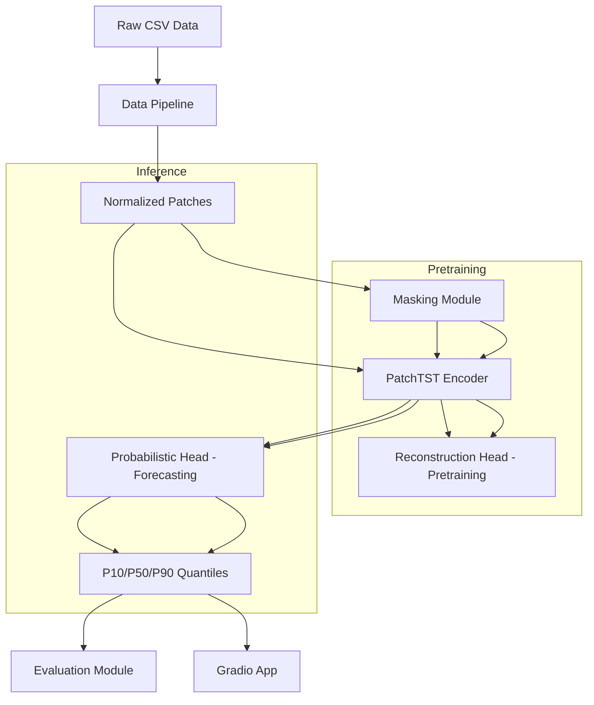
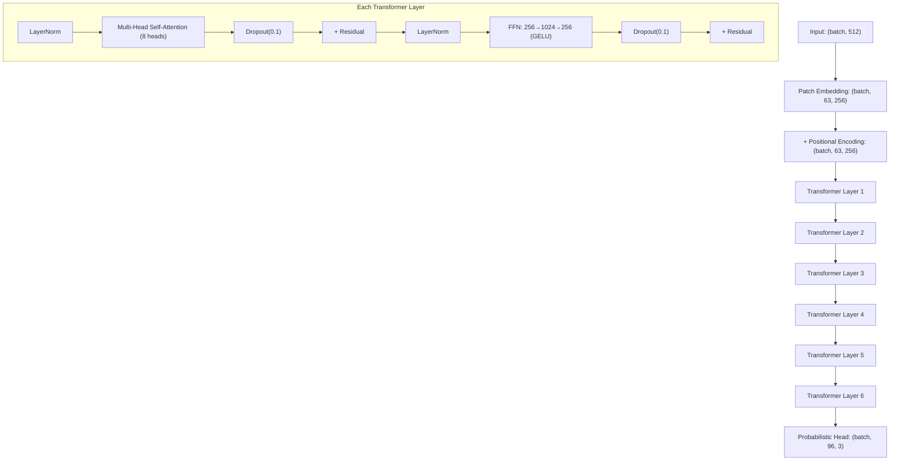
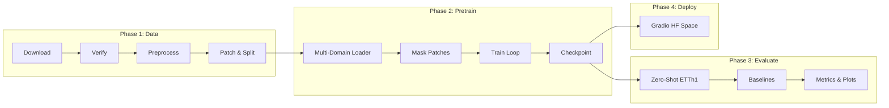

# Design Document: Time Series Foundation Model

## Overview

This design describes a Time Series Foundation Model built from scratch using the PatchTST architecture. The system pretrains a channel-independent patch transformer on three domains (Energy, Weather, Finance) using Masked Patch Modeling (MPM), then evaluates zero-shot on the ETTh1 benchmark with probabilistic forecasting (P10/P50/P90 quantiles). The final model is deployed as an interactive HuggingFace Space Gradio application.

**Key Design Decisions:**

1. **Channel-Independent Design**: Each univariate channel is processed independently through the same transformer weights, enabling the model to generalize across domains with different numbers of channels.
2. **Patch-Based Tokenization**: Time series are segmented into overlapping patches (length 16, stride 8), reducing sequence length from 512 to 63 tokens and enabling the transformer to capture local semantic information within each patch.
3. **Masked Patch Modeling**: Self-supervised pretraining masks 40% of patches and reconstructs them, learning rich temporal representations without labeled data.
4. **Probabilistic Output**: A quantile regression head produces P10/P50/P90 forecasts with monotonicity enforcement, providing calibrated uncertainty estimates.
5. **Colab-First Constraints**: All design choices respect the T4 GPU (15GB VRAM) limit — the model stays under 10M parameters, uses gradient accumulation (effective batch 128), and checkpoints to Google Drive.

**Research References:**
- PatchTST: "A Time Series is Worth 64 Words" ([Nie et al., 2023](https://arxiv.org/abs/2211.14730)) — introduces patch tokenization and channel independence for time series transformers
- Masked Patch Modeling for self-supervised pretraining of time series transformers ([arxiv.org/abs/2601.20845](https://arxiv.org/abs/2601.20845))
- CRPS as a proper scoring rule for probabilistic forecasts ([skforecast.org](https://skforecast.org/0.18.0/faq/probabilistic-forecasting-crps-score))

## Architecture

### High-Level Architecture



### Model Architecture Detail



### System Pipeline



## Components and Interfaces

### Project Directory Structure

```
Time-Series-Foundation-Model/
├── config.py                    # All hyperparameters
├── setup.py                     # Pinned dependencies
├── requirements.txt             # HuggingFace Space deps
├── README.md                    # Step-by-step guide
├── data/
│   ├── download.py              # Dataset acquisition with retry
│   ├── preprocess.py            # Normalization and splitting
│   ├── patching.py              # Patch creation logic
│   ├── dataset.py               # PyTorch Dataset classes
│   └── raw/                     # Downloaded CSVs
│       └── etth1/
├── model/
│   ├── patch_embedding.py       # Patch projection + positional encoding
│   ├── attention.py             # Multi-head self-attention
│   ├── transformer_layer.py     # Single encoder layer
│   ├── encoder.py               # Full 6-layer encoder
│   └── patchtst.py              # Top-level model assembly
├── pretraining/
│   ├── masking.py               # Random patch masking
│   ├── reconstruction_head.py   # MSE reconstruction output
│   └── train.py                 # Pretraining loop with multi-domain
├── forecasting/
│   ├── probabilistic_head.py    # Quantile regression head
│   ├── finetune.py              # Fine-tune on ETTh1
│   └── inference.py             # Zero-shot inference
├── evaluation/
│   ├── metrics.py               # MAE, MSE, MASE, CRPS
│   ├── baselines.py             # ARIMA, Prophet
│   ├── evaluate.py              # Full evaluation pipeline
│   └── visualize.py             # Plotting with intervals
├── utils/
│   ├── colab_helpers.py         # Drive mount, checkpoints, VRAM
│   └── logger.py                # W&B + CSV fallback logging
└── app/
    └── app.py                   # Gradio demo entry point
```

### Component Interfaces

#### `config.py`

```python
# Central configuration — imported by all modules
class Config:
    # Model architecture
    D_MODEL: int = 256
    N_HEADS: int = 8
    N_LAYERS: int = 6
    D_FF: int = 1024  # 4 * D_MODEL
    DROPOUT: float = 0.1
    
    # Patching
    PATCH_LEN: int = 16
    PATCH_STRIDE: int = 8
    CONTEXT_LENGTH: int = 512
    NUM_PATCHES: int = 63  # floor((512 - 16) / 8) + 1
    
    # Pretraining
    MASK_RATIO: float = 0.4
    PRETRAIN_LR: float = 1e-4
    PRETRAIN_EPOCHS: int = 20
    PRETRAIN_BATCH_SIZE: int = 32
    GRADIENT_ACCUMULATION: int = 4
    WEIGHT_DECAY: float = 0.01
    WARMUP_EPOCHS: int = 2
    MIN_LR: float = 1e-6
    
    # Forecasting
    FORECAST_HORIZON: int = 96
    QUANTILES: list = [0.1, 0.5, 0.9]
    
    # Fine-tuning
    FINETUNE_LR: float = 1e-5
    FINETUNE_EPOCHS: int = 10
    FINETUNE_BATCH_SIZE: int = 32
    
    # Data
    TRAIN_RATIO: float = 0.70
    VAL_RATIO: float = 0.15
    TEST_RATIO: float = 0.15
    MAX_RETRIES: int = 3
    RETRY_BASE_DELAY: float = 2.0
```

#### `data/download.py`

```python
def download_dataset(name: str, url: str, save_dir: str) -> str:
    """Download a dataset with retry logic. Returns path to saved file."""
    ...

def verify_dataset(filepath: str, min_rows: int = 1000) -> dict:
    """Verify dataset integrity. Returns stats dict or raises error."""
    ...

def download_all() -> None:
    """Download all 4 datasets (Energy, Weather, Finance, ETTh1)."""
    ...
```

#### `data/preprocess.py`

```python
def compute_normalization_stats(train_data: np.ndarray) -> dict:
    """Compute per-channel mean and std from training split only."""
    ...

def normalize(data: np.ndarray, stats: dict) -> np.ndarray:
    """Apply z-score normalization using precomputed stats."""
    ...

def inverse_normalize(data: np.ndarray, stats: dict) -> np.ndarray:
    """Reverse normalization for evaluation in original scale."""
    ...

def split_chronological(data: np.ndarray) -> tuple[np.ndarray, np.ndarray, np.ndarray]:
    """Split into train/val/test (70/15/15) preserving time order."""
    ...
```

#### `data/patching.py`

```python
def create_patches(series: np.ndarray, patch_len: int = 16, stride: int = 8) -> np.ndarray:
    """Segment a time series into overlapping patches. Discards trailing steps."""
    ...

def compute_num_patches(series_length: int, patch_len: int = 16, stride: int = 8) -> int:
    """Calculate number of patches: floor((L - patch_len) / stride) + 1."""
    ...
```

#### `data/dataset.py`

```python
class TimeSeriesDataset(torch.utils.data.Dataset):
    """PyTorch dataset yielding (context_window, target) pairs for a single domain."""
    def __init__(self, data: np.ndarray, context_length: int, forecast_horizon: int): ...
    def __len__(self) -> int: ...
    def __getitem__(self, idx: int) -> tuple[torch.Tensor, torch.Tensor]: ...

class MultiDomainDataLoader:
    """Round-robin interleaved batching across 3 domain datasets."""
    def __init__(self, datasets: list[TimeSeriesDataset], batch_size: int): ...
    def __iter__(self) -> Iterator[tuple[torch.Tensor, str]]: ...
```

#### `model/patch_embedding.py`

```python
class PatchEmbedding(nn.Module):
    """Linear projection of patches to D_MODEL dimension + positional encoding."""
    def __init__(self, patch_len: int, d_model: int, num_patches: int): ...
    def forward(self, patches: torch.Tensor) -> torch.Tensor: ...
```

#### `model/attention.py`

```python
class MultiHeadSelfAttention(nn.Module):
    """Standard multi-head self-attention with scaled dot-product."""
    def __init__(self, d_model: int, n_heads: int, dropout: float): ...
    def forward(self, x: torch.Tensor) -> torch.Tensor: ...
```

#### `model/transformer_layer.py`

```python
class TransformerEncoderLayer(nn.Module):
    """Pre-norm transformer layer: LN → MHSA → Residual → LN → FFN → Residual."""
    def __init__(self, d_model: int, n_heads: int, d_ff: int, dropout: float): ...
    def forward(self, x: torch.Tensor) -> torch.Tensor: ...
```

#### `model/encoder.py`

```python
class PatchTSTEncoder(nn.Module):
    """Stack of N transformer encoder layers with final layer norm."""
    def __init__(self, n_layers: int, d_model: int, n_heads: int, d_ff: int, dropout: float): ...
    def forward(self, x: torch.Tensor) -> torch.Tensor: ...
```

#### `model/patchtst.py`

```python
class PatchTSTModel(nn.Module):
    """Full PatchTST: patch embedding + encoder. Channel-independent."""
    def __init__(self, config: Config): ...
    def forward(self, x: torch.Tensor) -> torch.Tensor:
        """Input: (batch, context_length). Output: (batch, num_patches, d_model)."""
        ...
    def count_parameters(self) -> int: ...
```

#### `pretraining/masking.py`

```python
class PatchMasker:
    """Randomly masks patches and replaces with learnable mask token."""
    def __init__(self, mask_ratio: float, d_model: int): ...
    def mask_patches(self, patch_embeddings: torch.Tensor) -> tuple[torch.Tensor, torch.Tensor]:
        """Returns (masked_embeddings, mask_indices)."""
        ...
```

#### `pretraining/reconstruction_head.py`

```python
class ReconstructionHead(nn.Module):
    """Linear projection from D_MODEL back to patch_len for MSE reconstruction."""
    def __init__(self, d_model: int, patch_len: int): ...
    def forward(self, encoder_output: torch.Tensor) -> torch.Tensor: ...
```

#### `pretraining/train.py`

```python
def pretrain(model: PatchTSTModel, datasets: list, config: Config) -> None:
    """Full pretraining loop: multi-domain, masking, checkpointing."""
    ...
```

#### `forecasting/probabilistic_head.py`

```python
class ProbabilisticForecastHead(nn.Module):
    """Maps encoder output to (batch, forecast_horizon, 3) quantile predictions."""
    def __init__(self, d_model: int, num_patches: int, forecast_horizon: int, quantiles: list): ...
    def forward(self, encoder_output: torch.Tensor) -> torch.Tensor:
        """Output shape: (batch, 96, 3) with monotonicity enforced."""
        ...

def quantile_loss(predictions: torch.Tensor, targets: torch.Tensor, quantiles: list) -> torch.Tensor:
    """Pinball loss averaged across quantiles and time steps."""
    ...
```

#### `forecasting/inference.py`

```python
def zero_shot_forecast(model: PatchTSTModel, head: ProbabilisticForecastHead, 
                       data: np.ndarray, norm_stats: dict) -> np.ndarray:
    """Generate probabilistic forecasts without fine-tuning. Returns original scale."""
    ...
```

#### `evaluation/metrics.py`

```python
def mae(predictions: np.ndarray, targets: np.ndarray) -> float: ...
def mse(predictions: np.ndarray, targets: np.ndarray) -> float: ...
def mase(predictions: np.ndarray, targets: np.ndarray, seasonal_period: int = 24) -> float: ...
def crps_quantile(q_predictions: np.ndarray, targets: np.ndarray, quantiles: list) -> float:
    """CRPS approximated from quantile forecasts."""
    ...
```

#### `evaluation/baselines.py`

```python
def run_arima_baseline(train: np.ndarray, test_windows: list, horizon: int) -> np.ndarray: ...
def run_prophet_baseline(train: np.ndarray, test_windows: list, horizon: int) -> np.ndarray: ...
def seasonal_naive_fallback(history: np.ndarray, horizon: int, period: int = 24) -> np.ndarray: ...
```

#### `utils/colab_helpers.py`

```python
def mount_drive() -> None: ...
def save_checkpoint(model, optimizer, epoch: int, loss: float, max_keep: int = 5) -> str: ...
def load_checkpoint(model, optimizer) -> Optional[dict]: ...
def check_vram() -> bool: ...
def session_timer() -> float: ...
```

#### `utils/logger.py`

```python
class ExperimentLogger:
    """W&B logger with CSV fallback."""
    def __init__(self, config: Config, run_name: str): ...
    def log_epoch(self, metrics: dict) -> None: ...
    def finish(self) -> None: ...
```

#### `app/app.py`

```python
def load_model() -> tuple[PatchTSTModel, ProbabilisticForecastHead]: ...
def forecast(file, target_column: str, horizon: int) -> plt.Figure: ...
# Gradio interface setup
```

## Data Models

### Tensor Shapes Through the Pipeline

| Stage | Shape | Description |
|-------|-------|-------------|
| Raw input | `(batch, context_length)` = `(B, 512)` | Single univariate channel |
| After patching | `(batch, num_patches, patch_len)` = `(B, 63, 16)` | Overlapping patches |
| After embedding | `(batch, num_patches, d_model)` = `(B, 63, 256)` | Projected + positional |
| After encoder | `(batch, num_patches, d_model)` = `(B, 63, 256)` | Contextualized embeddings |
| Forecast output | `(batch, forecast_horizon, num_quantiles)` = `(B, 96, 3)` | P10/P50/P90 |

### Data Structures

#### Normalization Statistics (JSON)

```json
{
  "energy": {
    "channel_0": {"mean": 3.45, "std": 1.23},
    "channel_1": {"mean": 7.89, "std": 2.01}
  },
  "weather": { ... },
  "finance": { ... },
  "etth1": { ... }
}
```

#### Checkpoint Format (PyTorch .pt)

```python
{
    "model_state_dict": OrderedDict,
    "optimizer_state_dict": OrderedDict,
    "epoch": int,
    "train_loss": float,
    "val_loss": float,
    "config": dict,  # Serialized Config for reproducibility
    "timestamp": str  # YYYYMMDD_HHMMSS
}
```

#### Dataset Statistics (printed by verification)

```python
{
    "name": str,
    "rows": int,
    "columns": int,
    "date_range": {"start": str, "end": str},
    "missing_pct": float,
    "file_size_bytes": int
}
```

### Parameter Count Estimation

| Component | Parameters |
|-----------|-----------|
| Patch Embedding (16 → 256) | 16 × 256 + 256 = 4,352 |
| Positional Encoding (63 × 256) | 16,128 |
| Per Transformer Layer | ~790K |
| 6 Transformer Layers | ~4.74M |
| Reconstruction Head (256 → 16) | 4,112 |
| Probabilistic Head (63×256 → 96×3) | ~4.65M |
| **Total (pretraining)** | **~4.76M** |
| **Total (with forecast head)** | **~9.4M** |

This stays well under the 10M parameter budget and fits comfortably in T4 VRAM with batch size 32.

### Memory Budget (T4 GPU, 15GB VRAM)

| Item | Estimated Memory |
|------|-----------------|
| Model parameters (fp32) | ~38 MB |
| Optimizer states (AdamW, 2x) | ~76 MB |
| Gradients | ~38 MB |
| Activations (batch=32, 6 layers) | ~2.5 GB |
| Gradient accumulation (4 steps) | ~10 GB peak |
| **Total estimated** | **~12.6 GB** |
| **Available** | **15 GB** |
| **Headroom** | **~2.4 GB** |

## Correctness Properties

*A property is a characteristic or behavior that should hold true across all valid executions of a system — essentially, a formal statement about what the system should do. Properties serve as the bridge between human-readable specifications and machine-verifiable correctness guarantees.*

### Property 1: Normalization Round-Trip

*For any* valid time series array and its computed normalization statistics (mean, std), applying `normalize` followed by `inverse_normalize` shall recover the original values within floating-point tolerance (< 1e-6 absolute error per element).

**Validates: Requirements 3.1, 6.4**

### Property 2: Patch Count and Dimensions

*For any* time series of length L ≥ 16, the `create_patches` function with patch_len=16 and stride=8 shall produce exactly `floor((L - 16) / 8) + 1` patches, each of shape `(patch_len,)`, with no partial patches and no data beyond the last complete patch included.

**Validates: Requirements 3.2, 3.7**

### Property 3: Chronological Split Preservation

*For any* time series array, splitting into train/val/test with ratios 70/15/15 shall produce three non-overlapping contiguous sub-arrays whose concatenation equals the original array, with sizes summing to the original length (±1 due to integer rounding).

**Validates: Requirements 3.3**

### Property 4: Normalization Statistics Serialization Round-Trip

*For any* valid normalization statistics dictionary (containing per-channel mean and std as floats), serializing to JSON and deserializing shall produce an identical dictionary.

**Validates: Requirements 3.4**

### Property 5: Short Series Filtering

*For any* collection of time series with varying lengths, the filtering function shall retain only series with length ≥ 512 and discard all others, preserving the order of retained series.

**Validates: Requirements 3.5**

### Property 6: Model Output Shape Invariant

*For any* batch of inputs with shape `(B, 512)` where B ≥ 1, the PatchTST model forward pass shall produce output of shape `(B, 63, 256)`.

**Validates: Requirements 4.1, 4.6**

### Property 7: Invalid Input Rejection

*For any* input time series with length < 16 (minimum for one patch), the PatchTST model shall raise a ValueError indicating the minimum required input length.

**Validates: Requirements 4.8**

### Property 8: Mask Ratio Invariant

*For any* batch of patch embeddings with shape `(B, N, D)`, the masking module with ratio 0.4 shall mask exactly `round(0.4 * N)` patches per sample, replacing them with the learnable mask token.

**Validates: Requirements 5.1**

### Property 9: Masked-Only Loss Computation

*For any* batch of predictions, targets, and a binary mask, the masked reconstruction loss shall equal the MSE computed only over positions where mask=True, ignoring all unmasked positions entirely.

**Validates: Requirements 5.2**

### Property 10: Probabilistic Head Output Shape

*For any* encoder output of shape `(B, 63, 256)`, the probabilistic forecast head shall produce output of shape `(B, 96, 3)` representing P10/P50/P90 quantiles for 96 forecast steps.

**Validates: Requirements 6.1**

### Property 11: Pinball Loss Correctness

*For any* prediction value `q_hat`, actual value `y`, and quantile level `tau` in [0,1]: the pinball loss shall equal `tau * max(y - q_hat, 0) + (1 - tau) * max(q_hat - y, 0)`.

**Validates: Requirements 6.2**

### Property 12: Quantile Monotonicity

*For any* output of the probabilistic forecast head with shape `(B, 96, 3)`, the values at every position shall satisfy `output[b, t, 0] <= output[b, t, 1] <= output[b, t, 2]` (P10 ≤ P50 ≤ P90) for all batch indices b and time steps t.

**Validates: Requirements 6.3**

### Property 13: Sliding Window Count

*For any* test set of length T with context_window=512, forecast_horizon=96, and stride=96, the number of evaluation windows shall equal `floor((T - 512 - 96) / 96) + 1`, and each window shall be non-overlapping in its forecast portion.

**Validates: Requirements 7.2**

### Property 14: Seasonal Naive Periodicity

*For any* history array and forecast horizon h with seasonal period p=24, the seasonal naive forecast shall produce values where `forecast[t] == history[-(p - (t % p))]` for all t in [0, h), repeating the last full seasonal cycle.

**Validates: Requirements 8.4, 8.5**

### Property 15: Metric Non-Negativity and Relationships

*For any* predictions and targets arrays of equal shape, MAE and MSE shall be non-negative, and the relationship `MAE <= sqrt(MSE * n) / n` (Cauchy-Schwarz) shall hold. Additionally, if predictions equal targets exactly, all metrics shall be zero.

**Validates: Requirements 9.1**

### Property 16: Checkpoint Retention Limit

*For any* sequence of N checkpoint save operations with max_keep=5, the number of checkpoint files remaining shall be `min(N, 5)`, and they shall be the 5 most recently created files.

**Validates: Requirements 10.2**

### Property 17: Early Stopping Detection

*For any* sequence of validation loss values, the early stopping function shall trigger if and only if the most recent 3 consecutive values are all strictly greater than their respective predecessors (3 consecutive increases), or if any value is NaN.

**Validates: Requirements 12.5**

### Property 18: CSV Input Validation

*For any* uploaded CSV file, the validation function shall: (a) reject files with fewer than 512 rows, (b) correctly identify all numeric columns (int/float dtypes) for the dropdown, and (c) reject files with zero numeric columns or no datetime-parseable column.

**Validates: Requirements 13.2, 13.5, 13.6**

## Error Handling

### Error Categories and Strategies

| Category | Error Type | Strategy | Recovery |
|----------|-----------|----------|----------|
| **Network** | Download failure | Retry 3x with exponential backoff (2s, 4s, 8s) | Report URL and failure reason |
| **Data Validation** | Corrupt/short CSV | Delete file, report validation failure | User re-downloads |
| **Data Validation** | Series too short | Discard + log warning | Continue with valid series |
| **Data Validation** | Zero std channel | Set std=1.0 + log warning | Continue processing |
| **Model Input** | Wrong input length | Raise ValueError with expected dims | Caller fixes input |
| **Training** | Loss NaN/divergence | Stop training, save last valid checkpoint | User adjusts hyperparams |
| **Training** | Step timeout (>20min) | Warning + auto-checkpoint | Continue training |
| **Checkpoint** | Save failure | Raise IOError with message | User checks Drive space |
| **Checkpoint** | Load failure (missing) | Return None, print message | Start from scratch |
| **Hardware** | No GPU detected | Return False from check_vram() | User enables GPU runtime |
| **External Service** | W&B unavailable | Fallback to local CSV logging | Training continues |
| **External Service** | ARIMA/Prophet failure | Seasonal naive fallback | Evaluation continues |
| **Inference** | Timeout (>30s) | Display error, allow retry | User retries |
| **App Input** | Invalid CSV format | Display specific error message | User uploads valid file |

### Error Propagation Rules

1. **Data errors** are caught at the boundary (download/preprocess) and never propagate to model code
2. **Training errors** (NaN, divergence) trigger graceful shutdown with checkpoint preservation
3. **Inference errors** are caught in the Gradio app and displayed as user-friendly messages
4. **External service errors** (W&B, ARIMA, Prophet) always have local fallbacks — training/evaluation never stops due to external failures

### Logging Strategy

- All warnings and errors are printed to stdout (Colab-friendly)
- Training metrics go to W&B (primary) or CSV (fallback)
- No silent failures — every error path produces a visible message

## Testing Strategy

### Property-Based Testing

**Library**: [Hypothesis](https://hypothesis.readthedocs.io/) (Python's standard PBT library)

**Configuration**: Minimum 100 iterations per property test, using `@settings(max_examples=100)`

Property-based tests will validate the 18 correctness properties defined above. Each test will:
- Use Hypothesis strategies to generate random inputs
- Reference the design property via tag comment
- Run at minimum 100 iterations to explore the input space

**Tag format**: `# Feature: time-series-foundation-model, Property {N}: {title}`

Example test structure:
```python
from hypothesis import given, settings
from hypothesis import strategies as st

# Feature: time-series-foundation-model, Property 2: Patch Count and Dimensions
@given(series_length=st.integers(min_value=16, max_value=2048))
@settings(max_examples=100)
def test_patch_count_formula(series_length):
    series = np.random.randn(series_length)
    patches = create_patches(series, patch_len=16, stride=8)
    expected_count = (series_length - 16) // 8 + 1
    assert patches.shape[0] == expected_count
    assert patches.shape[1] == 16
```

### Unit Tests (Example-Based)

Unit tests cover specific examples, architectural checks, and integration points:

| Component | Test Focus |
|-----------|-----------|
| `config.py` | All constants have expected values |
| `model/` | Layer count, head count, parameter count < 10M |
| `data/download.py` | Skip existing files, retry on mock failures |
| `pretraining/train.py` | Optimizer config, LR schedule shape |
| `evaluation/visualize.py` | Plot files created with correct DPI |
| `utils/colab_helpers.py` | No GPU returns False, empty dir returns None |
| `app/app.py` | Gradio interface has expected components |

### Integration Tests

Integration tests verify end-to-end pipelines with small synthetic data:

1. **Data pipeline**: Download mock → preprocess → patch → dataset creation
2. **Training loop**: 1 epoch on tiny synthetic data, verify checkpoint saved
3. **Inference pipeline**: Load checkpoint → run on synthetic input → verify output shape
4. **Evaluation pipeline**: Compute all metrics on known synthetic predictions
5. **Gradio app**: Upload test CSV → verify forecast plot generated

### Test Execution

```bash
# Run all property-based tests
pytest tests/properties/ -v --hypothesis-show-statistics

# Run unit tests
pytest tests/unit/ -v

# Run integration tests (requires GPU mock or actual GPU)
pytest tests/integration/ -v

# Run all tests
pytest tests/ -v
```

### Coverage Targets

- Property tests: Cover all 18 correctness properties
- Unit tests: Cover architectural constraints and error paths
- Integration tests: Cover each pipeline stage end-to-end
- Combined target: >80% line coverage on core modules (model/, data/, evaluation/)

